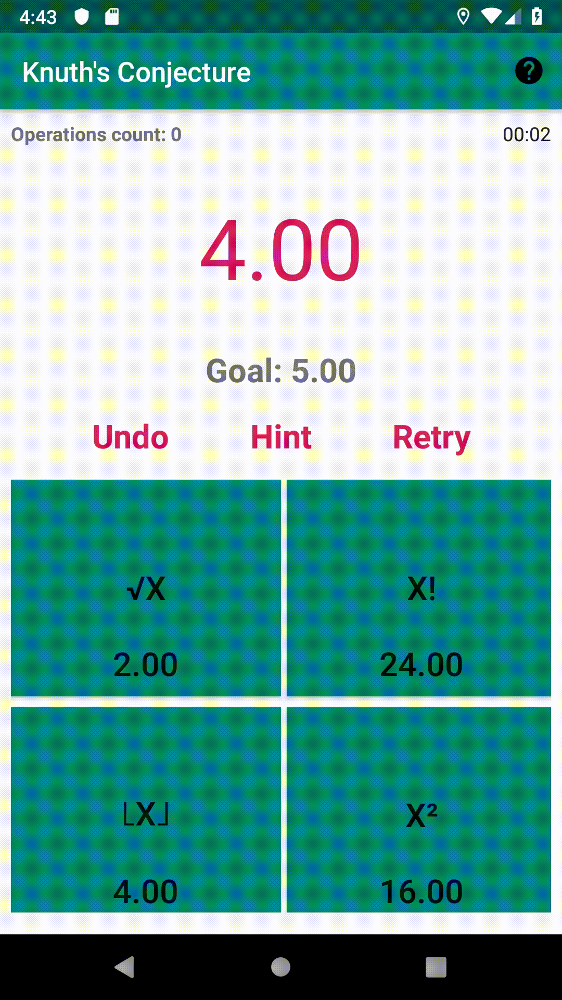

  

-----------------

This Android application is a little game based on Donald Knuth's conjecture that all integers can be made with a combination of square roots, factorials and floors and square starting from 4 (we also add square to make the problem a bit easier).

Of course this game is not really fun to play, but still interresting.

## The solver

It's a simple BFS to explore the space of solution, we stop when we found the solution.
For technical reasons, we don't do factorial above 30, so we don't explore all the possible solutions.
So, to make the game solvable I've limit the goal to a set of value accessible in less than 8 steps with the solver.

  

## What I've used

* ButterKnife
* MVP architecture
